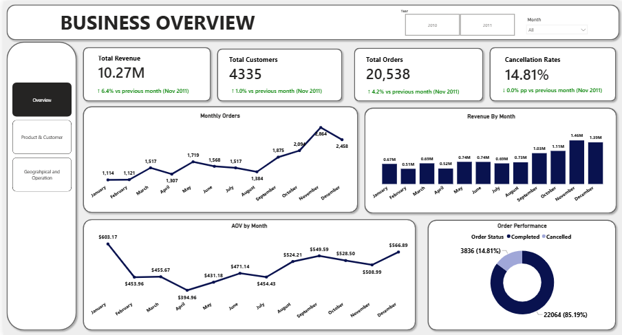
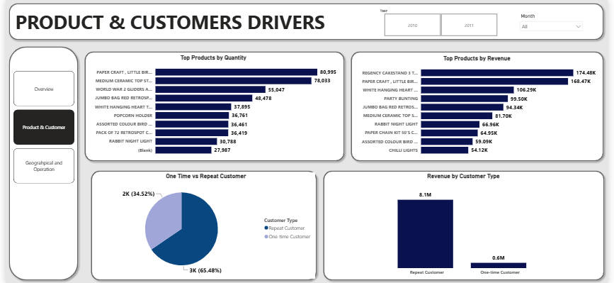
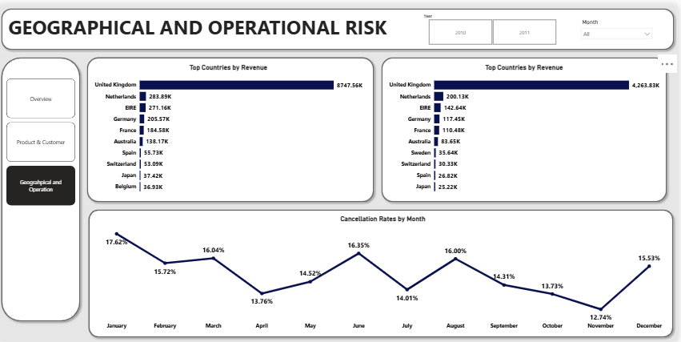

# Online Retail Sales Analysis

## Project Overview

This project analyzes transactional data from a UK-based online retail business to understand sales performance, customer behavior,
product performance, geographic performance, and order cancellations. The dataset is  atransactional data set which contains all the transactions 
occurring between 01/12/2010 and 09/12/2011 for a UK-based and registered non-store online retail. The company mainly sells unique 
all-occasion gifts. Many customers of the company are wholesalers.


## Project Objective

The objective of this project is to analyze the company's transactional data and identify patterns in:

* Overall revenue and order performance
* Monthly sales trends
* Product performance
* Customer purchasing behavior
* Geographic performance
* Order cancellations

The analysis provides a structured view of the business's sales activity and customer base.

---

##  Dataset

The dataset contains transactional records from a UK-based, non-store online retail business.

**Period:** December 2010 – December 2011

The company specializes in unique all-occasion gifts, with many customers being wholesalers.

### Key Variables

| Variable      | Description                      |
| ------------- | -------------------------------- |
| `InvoiceNo`   | Unique invoice/order number      |
| `StockCode`   | Product or transaction code      |
| `Description` | Product description              |
| `Quantity`    | Number of items purchased        |
| `InvoiceDate` | Date and time of the transaction |
| `UnitPrice`   | Price per item                   |
| `CustomerID`  | Unique customer identifier       |
| `Country`     | Customer's country               |

---

## Data Cleaning & Feature Engineering

The dataset was prepared before analysis to make the transactional data suitable for sales analysis.

### Key transformations

**1. Merchandise classification**

A new `Is_Merchandise` field was created to distinguish merchandise products from non-merchandise transaction records.

Special transaction codes included records relating to:

* Adjustments
* Manual entries
* Discounts
* Samples
* Carriage
* Postage
* Commission

**2. Month extraction**

A `Month` field was created from `InvoiceDate` to support monthly analysis.

**3. Total transaction amount**

A `TotalAmount` field was calculated as:

```text
TotalAmount = Quantity × UnitPrice
```

For sales performance analysis, merchandise transactions with positive quantities were used.

Cancellation records were retained because they are useful for understanding order cancellation behavior.

---

## Analytical Questions

### 1. Overall Performance

* What is the total revenue?
* How many customers and orders does the business have?
* How does revenue change throughout the year?
* How does average order value vary by month?

### 2. Product Performance

* Which products generate the highest revenue?
* Which products have the highest sales quantity?
* Are the highest-volume products also the highest-revenue products?

### 3. Customer Behavior

* What proportion of customers are one-time versus repeat customers?
* How much revenue is associated with each customer group?

### 4. Geographic Performance

* Which countries generate the most revenue?
* Which countries have the highest order quantities?

### 5. Order Performance

* How many orders are cancelled?
* What percentage of orders are cancelled?
* How does cancellation performance vary over time?

---

## Tools & Technologies

* **SQL / PostgreSQL** — data analysis and querying
* **Power BI** — data visualization and dashboard development
* **Excel** — initial data cleaning and feature engineering
* **GitHub** — project documentation and version control

---

## Key Findings

### Revenue Performance

The business generated **10.27M** across **20,538 orders** and **4,335 customers**.

Revenue varied considerably throughout the year:

* **November** recorded the highest revenue at **1.46M**
* **February** recorded the lowest revenue at **508.9K**
* November also recorded the highest order volume with **2,864 orders**

### Average Order Value

January recorded the highest average order value at **603.17**, despite having the lowest monthly order volume at **1,114 orders**.

This shows that order volume and average order value did not necessarily move in the same direction.

### Product Performance

The analysis identified differences between products with high revenue and products with high sales volume.

This demonstrates that a product selling a large number of units is not necessarily the product generating the highest revenue.

### Customer Behavior

The customer analysis classified customers into:

* One-time customers
* Repeat customers

The analysis found that **65.48%** of customers were repeat customers, while **34.52%** were one-time customers.

### Geographic Performance

The **United Kingdom** generated the highest revenue at approximately **8,747.56K**, followed by:

* Netherlands — **283.9K**
* EIRE — **271.16K**

### Order Cancellations

The analysis found:

* **14.81%** cancelled orders
* **85.19%** completed orders

This means approximately 1 in 7 orders in the analyzed data was classified as cancelled.

---

##  Power BI Dashboard

The Power BI dashboard provides an interactive view of the analysis, allowing users to explore:

* Revenue performance
* Order volume
* Customer metrics
* Average order value
* Product performance
* Customer types
* Geographic performance
* Cancellation trends

### Dashboard Preview






##  Conclusion

This project demonstrates an end-to-end approach to analyzing transactional retail data, from data preparation and SQL analysis to interactive Power BI visualization.

The analysis highlights changes in sales performance, differences between product volume and revenue, customer purchasing patterns, geographic contribution, and order cancellations.


